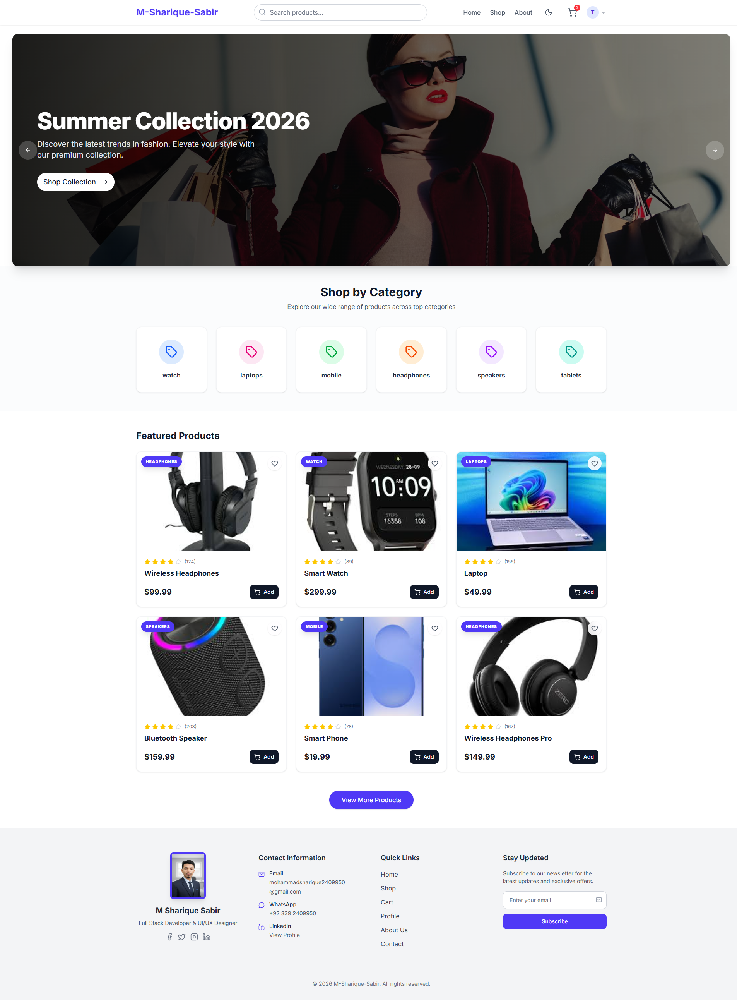
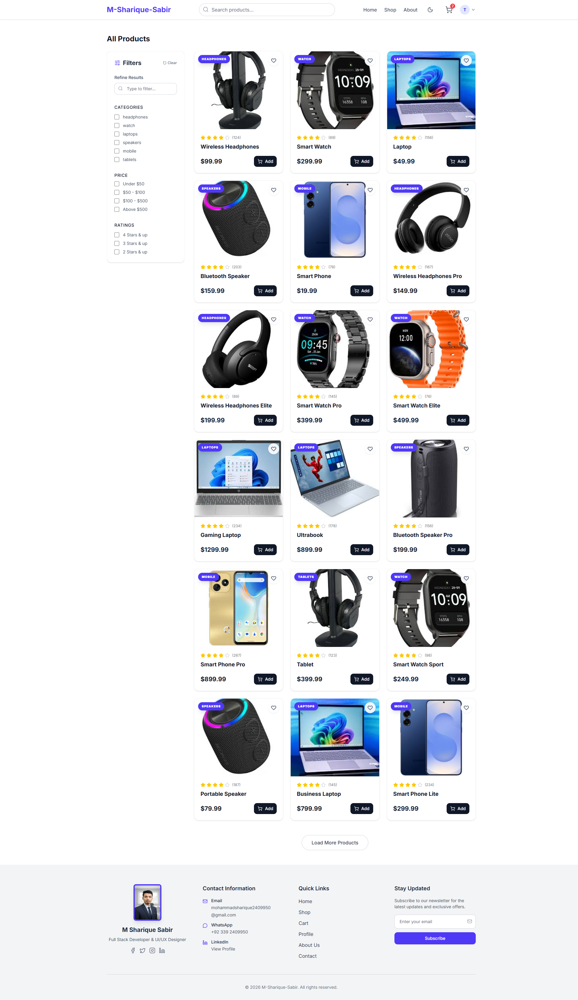
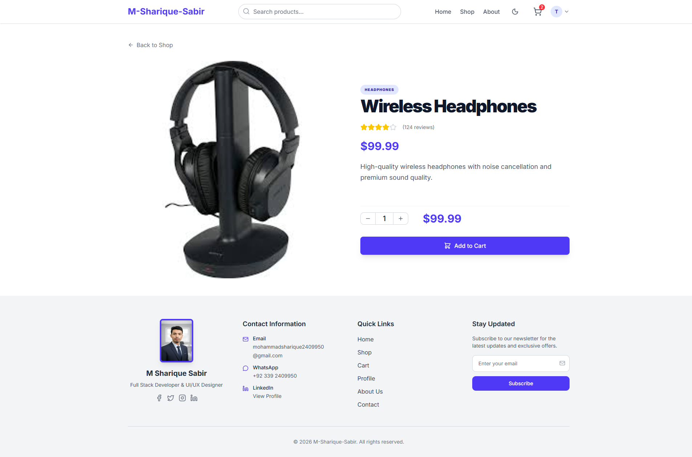
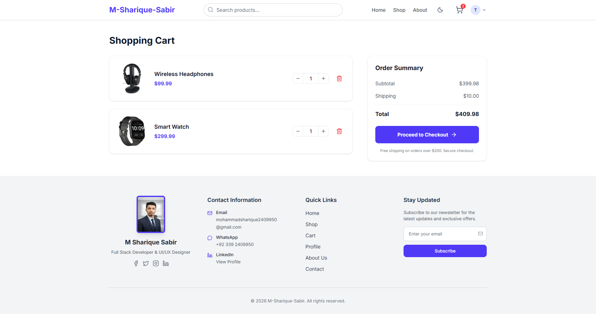
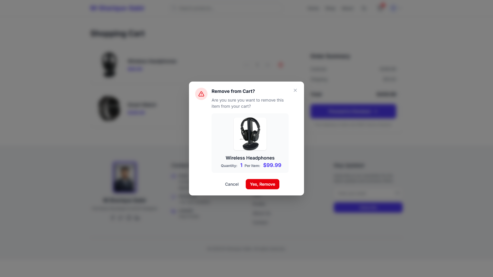
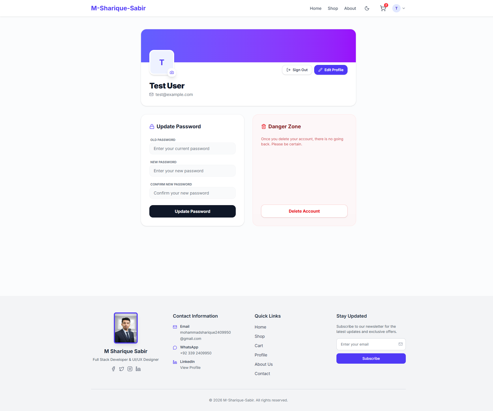

# Product App — Modern E-Commerce Frontend

A fully-featured, production-grade e-commerce frontend built with **React 19**, **Vite**, **Tailwind CSS v4**, and **TypeScript**. This isn't a demo or a tutorial project — it's a complete shopping experience with real functionality, polished UI, and enterprise-level architecture.



---

## Live Demo

> **Clone, install, and run in 3 steps:**

```bash
git clone https://github.com/m-sharique-sabir/E-Commerce-Platforms-System-Design.git
cd E-Commerce-Platforms-System-Design
npm install && npm run dev
```

Open **http://localhost:5173** and explore the full application.

---

## What This App Does

**Product App** is a modern digital storefront where customers can browse, search, filter, and purchase tech products — all from a sleek, responsive interface. Here's what users can actually do:

### Browse & Discover
- **Hero carousel** with dynamic product highlights on the homepage
- **Category browsing** — jump straight to headphones, smartwatches, phones, laptops, or speakers
- **Featured products** section showcasing the best items front and center

### Search & Filter



- **Real-time search** — find products instantly by name or category from the navbar
- **Advanced sidebar filters** on the Shop page — filter by category, price range, and customer rating
- **Search history** — the app remembers your past searches for faster access
- **Filter persistence** — your preferences stay saved across sessions

### Product Details



- **Single product view** with quantity selector
- **High-quality product images** and detailed descriptions
- **Add to cart** directly from the product page

### Shopping Cart



- **Add to cart** from any product card or detail page
- **Quantity controls** — increase, decrease, or remove items
- **Live cart summary** — see totals update in real-time
- **Order summary** at checkout with itemized breakdown
- **Persistent cart** — items survive page refreshes and browser restarts



- **Custom confirmation modal** for item removal with product preview
- **Backdrop blur overlay** for focused decision making
- **Smooth zoom-in animation** on modal appearance

### User Accounts



- **Sign up** with name, email, and password (with validation)
- **Login/Logout** with session persistence
- **Profile management** — edit your name, email, and password
- **Account deletion** with confirmation dialog
- **Protected routes** — cart and profile require authentication

### Design & Experience
- **Dark/Light theme toggle** — switch with one click, persists across sessions
- **Fully responsive** — looks perfect on desktop, tablet, and mobile
- **Mobile hamburger menu** — clean navigation on small screens
- **Toast notifications** — instant feedback for every action
- **Smooth transitions** — polished animations throughout

---

## How It Works

### Architecture

The app is a single-page application (SPA) with client-side routing. Every page loads instantly without full-page refreshes. Here's the flow:

```
User Action → React Component → Context/Service → localStorage → UI Update
```

- **React Router DOM** handles all navigation with nested routes and protected routes
- **React Context API** manages global state (cart contents, theme preference)
- **Service classes** encapsulate all business logic (authentication, product data, cart operations)
- **localStorage** provides instant data persistence without a backend

### Tech Stack

| Technology | Role |
|---|---|
| React 19 | Component-based UI library |
| TypeScript | Type-safe development |
| Vite 7 | Lightning-fast build tool |
| Tailwind CSS v4 | Utility-first styling |
| shadcn/ui (Radix) | Accessible UI primitives |
| Lucide React | Consistent icon system |
| React Hook Form + Zod | Form validation |
| Sonner | Toast notifications |
| Embla Carousel | Smooth carousel engine |
| TanStack Table | Data table capabilities |

### Key Features Under the Hood

- **Mock authentication system** with base64 password hashing and salt — ready to swap for a real backend
- **Cart service** with 18 pre-loaded tech products across 6 categories
- **User preferences service** storing search history and filter selections
- **Theme system** using CSS custom properties (oklch color space) with class-based dark mode
- **Component library** built on shadcn/ui "new-york" style with CVA variants

---

## Quick Start

### Prerequisites
- Node.js 18 or higher
- npm, yarn, or pnpm

### Installation

```bash
git clone https://github.com/m-sharique-sabir/E-Commerce-Platforms-System-Design.git
cd E-Commerce-Platforms-System-Design
npm install
npm run dev
```

### Available Commands

| Command | What it does |
|---|---|
| `npm run dev` | Start development server on port 5173 |
| `npm run build` | Build optimized production bundle |
| `npm run preview` | Preview production build locally |
| `npm run lint` | Run ESLint checks |

---

## Built By

**Mohammad Sharique Sabir** — Full Stack Developer  
React &middot; Next.js &middot; Laravel &middot; MERN Stack Specialist

- Email: mohammadsharique2409950@gmail.com
- LinkedIn: [linkedin.com/in/m-sharique-sabir](https://www.linkedin.com/in/m-sharique-sabir/)
- WhatsApp: +92 339 2409950

---

## License

MIT License — free to use, modify, and distribute.
